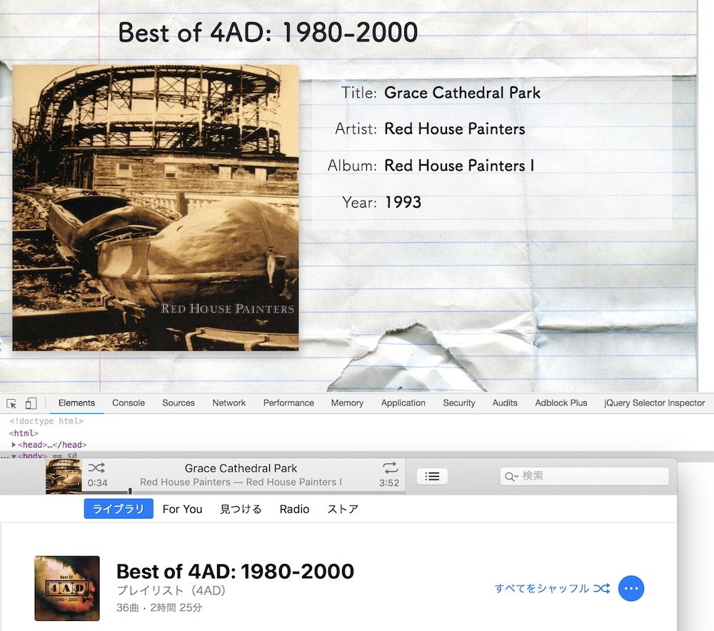

# iTunes Current Song Viewer



## Memo

## expand JXA child process buffer size

```
$ vim ./node_modules/@jxa/run/lib/run.js
```

```js
// L25-28
env: {
    OSA_ARGS: JSON.stringify(args)
}
maxBuffer: 1000 * 1024 // add this line
```
